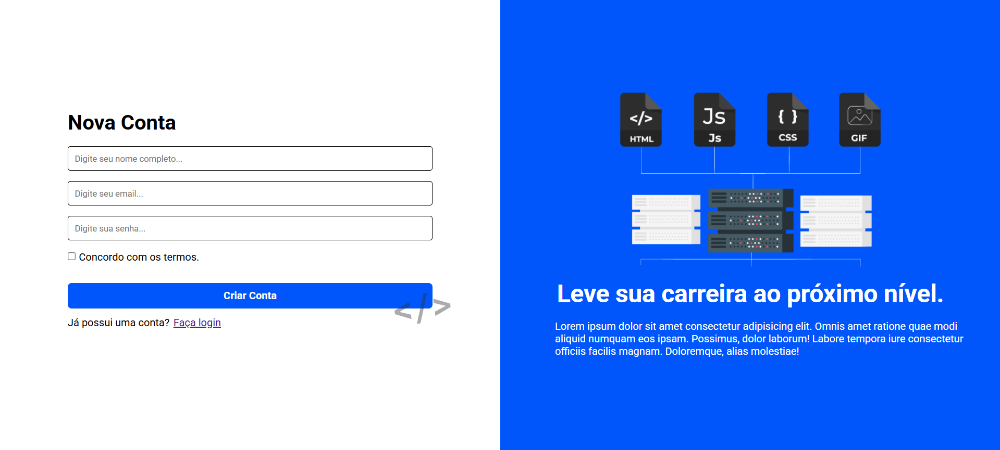

# 📋 Register Page

Este projeto é uma **tela de cadastro fictícia** desenvolvida para treinar habilidades em **HTML**, **CSS**, **Flexbox** e **Media Queries**.

## 🧠 Sobre o Projeto

A página foi criada como parte de um **desafio do treinamento Full Stack Pro**. O objetivo foi **praticar responsividade** e o uso correto de **Flexbox** para criação de layouts modernos.

## 🛠 Tecnologias Utilizadas

- HTML5

- CSS3

- Flexbox

- Media Queries

## 🔗 Acesse o Projeto

Você pode ver o resultado final acessando o link abaixo:

👉 [Clique para visualizar online](https://bispo1307.github.io/Register-Page/index.html)

## 💡 Aprendizados

- Estruturação de formulários HTML

- Posicionamento com Flexbox

- Design responsivo com Media Queries

- Boas práticas de estilização CSS

---

📁 Este projeto é de fins educacionais e faz parte da minha jornada como desenvolvedor Front-End.